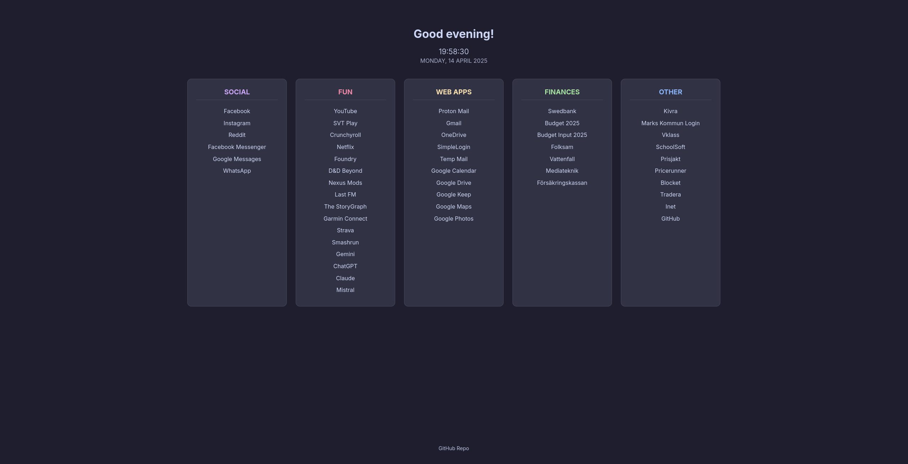

# Mikael's Personal Homepage


A clean, responsive, personalized startpage based on GABEstart/GetStarted. Displays categorized links and dynamic time/date information with a Catppuccin Mocha theme.

## Features

* **Theme:** Uses the **Catppuccin Mocha** color palette, defined via CSS variables in `styles.css`.
* **Layout:**
    * **Desktop:** Displays 5 category boxes in a centered grid layout.
    * **Mobile:** Shows one category at a time with tabs for navigation.
* **Content:**
    * **5 Categories:** Links are organized into 5 main categories.
    * **Configurable Links:** Categories and bookmarks are easily customized by editing the `config.js` file.
    * **Dynamic Header:** Shows a time-based greeting (Good morning/afternoon/etc.), the current time (Swedish format), and the current date (English format, uppercase).
* **Font:** Uses the "Inter" font from Google Fonts.

## Configuration

Most configuration is done in the `config.js` file:

1.  **`userName`:** Set the `userName` variable to change the name potentially used in greetings (though currently only the greeting itself is shown).
    ```javascript
    const userName = "YourName";
    ```
2.  **`cards`:** This array holds the configuration for the 5 category boxes. Each object in the array represents one box:
    ```javascript
    const cards = [
      {
        name: "Category Title", // This MUST match the id="box-..." in index.html (lowercase, hyphens for spaces) and the <h2> text
        bookmarks: {
          "Link Display Name": "[https://link-url.com/](https://link-url.com/)",
          "Another Link": "[https://another-url.com/](https://another-url.com/)"
          // Add more bookmarks here
        }
      },
      // ... more category objects (exactly 5 total) ...
    ];
    ```
    * Make sure the `name` property exactly matches the intended category title and corresponds to the `id` used in `index.html` (e.g., `name: "Web-Apps"` corresponds to `id="box-web-apps"`).
    * Add/edit/remove links within the `bookmarks` object for each category.

## Credits

This project is a personalized version based on:

* **GABEstart** by [GABEweb](https://github.com/gabeweb) (The direct fork source).
* **GetStarted** by [MrAlpha786](https://github.com/MrAlpha786) (The original base template).

It also uses:

* **Catppuccin Theme Palette:** Colors adapted from the [Catppuccin Mocha theme](https://github.com/catppuccin/catppuccin).
* **Inter Font:** Served via [Google Fonts](https://fonts.google.com/specimen/Inter).
---
