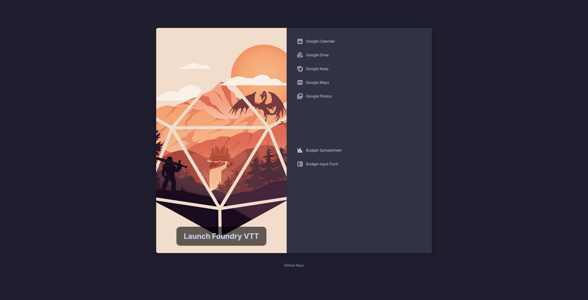

# Brave Startpage - Focused Launcher


A minimal, two-panel startpage designed for quick access to Foundry VTT and frequently used Google services & finance links. Built with HTML, CSS, and vanilla JavaScript, featuring a Catppuccin Mocha theme.

## Features

- **Two-Panel Layout:**
   - **Left Panel:** Large, clickable image linking directly to Foundry VTT.
   - **Right Panel:** Two columns displaying links with icons and names for:
      - Google Services
      - Personal Finance links
- **Theme:** Styled with the **Catppuccin Mocha** color palette.
- **Icons:** Links are displayed with associated icons for quick recognition.
- **Responsive:** Adapts to smaller screen sizes by stacking panels.
- **Configurable:** Links and icon paths are managed through `config.js`.


## Configuration
All customization for the links is done in the **`config.js`** file.

### 1. Foundry VTT Link
To change the URL for the main Foundry VTT link on the left panel, edit the `foundryVTT_url` constant:

```javascript
// config.js
const foundryVTT_url = "YOUR_FOUNDRY_VTT_URL_HERE";
```

### 2. Adding/Modifying Links in the Right Panel
The right panel contains two lists: "Google Services" and "Finance Links". These are populated from the googleServices and financeLinks arrays in config.js respectively.

**To add or modify a link:**
   **1. Prepare your Icon:**     
      - Find or create an icon (preferably SVG, but PNG/JPG will work) for your link.
      - Place the icon file in a suitable folder, for example, assets/icons/google/ for Google services or assets/icons/custom/ for other links.
   **2. Edit config.js:**
      - Open the config.js file.
      - Locate the array you want to modify (googleServices or financeLinks).
      - Each link in the array is an object with three properties: name, url, and icon.

```javascript
// Example structure for an item in googleServices or financeLinks:
{
    name: "Display Name for Link", // This text appears next to the icon
    url: "[https://www.example.com/](https://www.example.com/)", // The actual URL the link will point to
    icon: "assets/icons/your-icon-filename.svg" // The path to your icon file
}
```

   - **To add a new link:** Add a new object with these three properties to the desired array. Make sure to add a comma , after the preceding object if it's not the last one.
   - **To modify an existing link:** Change the name, url, or icon path for the existing object.
   - **To remove a link:** Delete the entire object for that link from the array.

**Example: Adding a new Google Service link:**

```javascript
// config.js

const googleServices = [
    {
        name: "Google Calendar",
        url: "[https://calendar.google.com/](https://calendar.google.com/)",
        icon: "assets/icons/google/calendar.svg"
    },
    {
        name: "Google Drive",
        url: "[https://drive.google.com/](https://drive.google.com/)",
        icon: "assets/icons/google/drive.svg"
    },
    // ... other existing Google services ...
    { // New link added:
        name: "Google News",
        url: "[https://news.google.com/](https://news.google.com/)",
        icon: "assets/icons/google/news.svg" // Assuming you added news.svg here
    }
];
```

**Example: Adding a new Finance link:**
```javascript
// config.js

const financeLinks = [
    {
        name: "Budget Spreadsheet",
        url: "YOUR_SPREADSHEET_URL",
        icon: "assets/icons/finance/gsheet.svg"
    },
    // ... other existing finance links ...
    { // New link added:
        name: "Bank Login",
        url: "[https://www.mybank.com/login](https://www.mybank.com/login)",
        icon: "assets/icons/finance/mybank-icon.png" // Assuming you added this icon
    }
];
```

### 3. Save config.js.
### 4. Refresh your index.html in the browser to see the changes.

---

## Credits
- This project utilizes the Catppuccin Mocha color palette.
- Font: Inter from Google Fonts.
- Concept inspired by various startpage projects.
